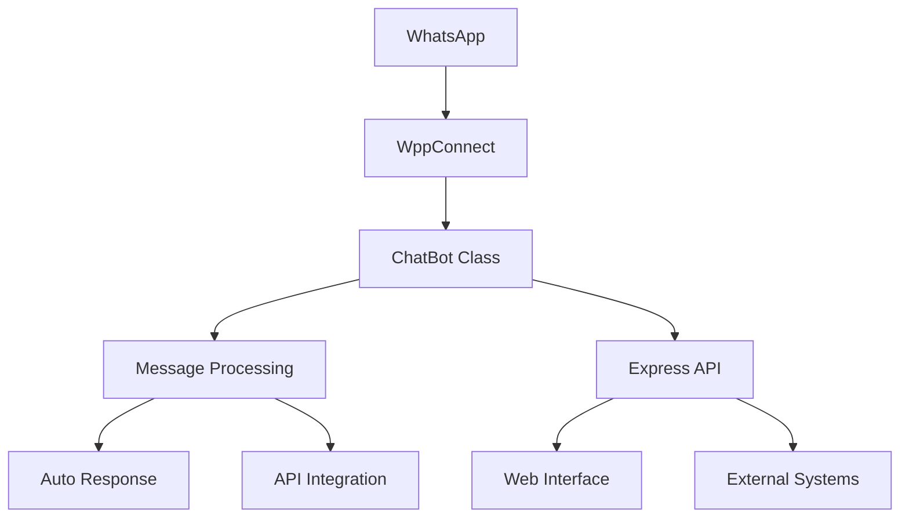

# 🍕 WhatsApp Bot - Boa Pizza | WppConnect + TypeScript

[](https://www.typescriptlang.org/)
[](https://nodejs.org/)
[](https://expressjs.com/)

> **Bot WhatsApp profissional para automação de atendimento de pizzaria, migrado do whatsapp-web.js para WppConnect com TypeScript completo.**

---

## 📋 **Índice**

- [📖 Sobre](#-sobre)
- [⚡ Funcionalidades](#-funcionalidades)
- [🚀 Instalação](#-instalação)
- [⚙️ Configuração](#️-configuração)
- [🎮 Como Usar](#-como-usar)
- [📡 API Endpoints](#-api-endpoints)
- [🏗️ Arquitetura](#️-arquitetura)
- [🔧 Scripts Disponíveis](#-scripts-disponíveis)
- [📊 Monitoramento](#-monitoramento)
- [🆘 Solução de Problemas](#-solução-de-problemas)
- [🤝 Contribuição](#-contribuição)

---

## 📖 **Sobre**

Sistema de automação WhatsApp desenvolvido especificamente para **Boa Pizza Pizzaria**, com migração completa do `whatsapp-web.js` para `WppConnect`, oferecendo:

- ✅ **70% menos uso de memória** (200MB vs 500MB+)
- ✅ **Estabilidade superior** com reconexão automática
- ✅ **TypeScript nativo** com tipagem forte
- ✅ **Interface web** para controle e monitoramento
- ✅ **API REST** completa para integração
- ✅ **Sistema de logs** profissional

---

## ⚡ **Funcionalidades**

### 🤖 **Automação Inteligente**

- Resposta automática com sistema de cooldown (1 hora)
- Saudação baseada no horário (Bom dia/Boa tarde/Boa noite)
- Comandos especiais (`/status`, `/info`, `/contato`, `/chrome`)
- Sistema de sessões persistentes

### 📱 **Gestão de Mensagens**

- Envio de mensagens individuais
- Broadcast de promoções com imagens
- Verificação automática de números válidos
- Sistema de delay configurável entre envios

### 🔄 **Integração e Sincronização**

- Webhook para sincronização com sistema externo
- API REST completa para integração
- Logs detalhados em arquivos diários
- Health check e restart automático

### 🌐 **Interface Web**

- Painel de controle intuitivo
- Monitoramento em tempo real
- Ações rápidas via interface
- Logs visuais e estatísticas

---

## 🚀 **Instalação**

### **Pré-requisitos**

```bash
# Node.js 18+ (recomendado)
node --version  # >= 18.0.0

# NPM
npm --version   # >= 8.0.0

# Google Chrome (para WhatsApp Web)
```

### **Clone e Instalação**

```bash
# 1. Clonar repositório
git clone https://github.com/seu-usuario/wppconnect-chatbot.git
cd wppconnect-chatbot

# 2. Instalar dependências
npm install

# 3. Compilar TypeScript
npm run build

# 4. Configurar (ver seção de configuração)
```

---

## ⚙️ **Configuração**

### **1. Configuração Principal** (`src/config.ts`)

```typescript
export const botConfig: BotConfig = {
  // ⚠️ IMPORTANTE: Ativar resposta automática
  msg_automatico: true, // ← ALTERE PARA true

  // 🔧 Configuração de integração
  urlSync: 'http://10.0.0.4:5070', // ← SEU ENDPOINT
  numeroNext: '554435286207@c.us', // ← SEU NÚMERO

  // 🍕 Dados da pizzaria
  site: 'https://boa-pizza.deliveryfacil.net.br/',
  estabelecimento: 'Boa Pizza Pizzaria LTDA!',
  mensagemBoasVindas: 'Seja bem-vindo à',
  mensagemCardapio: 'Faça seu pedido pelo nosso site exclusivo: ',

  // 📁 Caminhos
  caminhoImagens: './images', // ← Suas imagens de promoção

  // ⏱️ Configurações de timing
  delayPadrao: 10000, // 10 segundos entre envios
};
```

### **2. Números Específicos**

Edite no `config.ts` os números que recebem respostas especiais:

```typescript
specificNumbers: [
  {
    number: '554499149157@c.us', // ← Número VIP
    name: 'Cliente VIP',
    responses: [
      '🎉 Olá! Seja muito bem-vindo!',
      '📱 Este é um atendimento automatizado especial para você.',
    ],
    onlyOnce: true,
  },
];
```

### **3. Variáveis de Ambiente** (opcional)

```bash
# .env (crie o arquivo se necessário)
PORT=3000                    # Porta da API
NODE_ENV=production         # Ambiente
```

---

## 🎮 **Como Usar**

### **Modo Fácil (Scripts .bat)**

#### **Windows:**

```bash
# 1. Iniciar o bot
INICIAR-BOT.bat        # ← Clique duplo

# 2. Acessar interface web
http://localhost:3000   # ← Abrir no navegador

# 3. Parar o bot
PARAR-BOT.bat          # ← Clique duplo
```

### **Modo Desenvolvimento**

```bash
# Desenvolvimento com hot-reload
npm run dev

# Compilar para produção
npm run build

# Executar produção
npm start

# Monitorar mudanças
npm run watch
```

### **Primeira Execução**

1. Execute o bot: `npm run dev`
2. Aguarde o QR Code aparecer no terminal
3. Abra WhatsApp no celular
4. Vá em **Dispositivos Conectados > Conectar dispositivo**
5. Escaneie o QR Code
6. ✅ **Bot conectado!**

---

## 📡 **API Endpoints**

### **Autenticação e Status**

| Método | Endpoint   | Descrição                  | Resposta                                            |
| ------ | ---------- | -------------------------- | --------------------------------------------------- |
| `GET`  | `/ping`    | Teste de conectividade     | `200: {code: 200, msg: 'pong'}`                     |
| `GET`  | `/health`  | Status detalhado do bot    | `200: {code: 200, msg: 'CONNECTED'}`                |
| `POST` | `/restart` | Reiniciar cliente WhatsApp | `200: {code: 200, msg: 'Client restart initiated'}` |

### **Gestão de Contatos**

| Método | Endpoint        | Descrição                | Parâmetros |
| ------ | --------------- | ------------------------ | ---------- |
| `GET`  | `/get-contacts` | Listar contatos WhatsApp | -          |

### **Envio de Mensagens**

#### **Mensagem Simples**

```bash
POST /send-message
Content-Type: application/json

{
  "fone": "5511999999999",
  "mensagem": "Olá! Como posso ajudar?"
}
```

#### **Promoção com Imagens**

```bash
POST /send-promotion
Content-Type: application/json

{
  "embed": true,
  "phone": ["5511999999999", "5511888888888"],
  "message": "🍕 Promoção especial! Pizza família por R$ 29,90!",
  "image": ["promocao1.jpg", "promocao2.jpg"]
}
```

### **Monitoramento**

| Método | Endpoint | Descrição                 |
| ------ | -------- | ------------------------- |
| `GET`  | `/stats` | Estatísticas do bot       |
| `GET`  | `/`      | Interface web de controle |

---

## 🏗️ **Arquitetura**

### **Estrutura de Pastas**

```
wppconnect-chatbot/
├── src/
│   ├── types.ts         # 📝 Interfaces TypeScript
│   ├── config.ts        # ⚙️ Configurações principais
│   ├── logger.ts        # 📊 Sistema de logs
│   ├── chatbot.ts       # 🤖 Lógica principal do bot
│   ├── api.ts           # 🌐 API Express
│   ├── web-ui.ts        # 💻 Interface web
│   └── index.ts         # 🚀 Ponto de entrada
├── dist/                # 📦 Código compilado
├── tokens/              # 🔑 Sessões WhatsApp
├── images/              # 🖼️ Imagens para promoções
├── *.bat                # 🖱️ Scripts Windows
└── COMO-USAR.md         # 📋 Guia do usuário
```

### **Fluxo de Dados**



### **Tecnologias Utilizadas**

- **Runtime:** Node.js 18+
- **Linguagem:** TypeScript 5.0+
- **Framework:** Express.js 4.18+
- **WhatsApp:** WppConnect 1.30+
- **Processo:** PM2 (opcional)

---

## 🔧 **Scripts Disponíveis**

| Script              | Comando         | Descrição                          |
| ------------------- | --------------- | ---------------------------------- |
| **Desenvolvimento** | `npm run dev`   | Executa com ts-node e hot-reload   |
| **Build**           | `npm run build` | Compila TypeScript para JavaScript |
| **Produção**        | `npm start`     | Executa versão compilada           |
| **Watch**           | `npm run watch` | Monitora mudanças e recompila      |
| **Limpeza**         | `npm run clean` | Remove arquivos compilados         |

### **Scripts Windows (.bat)**

- `INICIAR-BOT.bat` - Inicia o bot com interface amigável
- `PARAR-BOT.bat` - Para todos os processos relacionados
- `INSTALAR-SERVICO.bat` - Instala como serviço Windows com PM2

---

## 📊 **Monitoramento**

### **Interface Web** (`http://localhost:3000`)

- ✅ Status em tempo real
- 🎮 Controles de reinicialização
- 📱 Teste de mensagens
- 📊 Logs visuais
- 👥 Lista de contatos

### **Logs em Arquivo**

- 📁 Localização: `src/logs/`
- 📅 Rotação diária: `DDMMAAAA.log`
- 📝 Níveis: `LOG`, `INFO`, `WARN`, `ERROR`

### **Comandos WhatsApp**

Digite no WhatsApp para debug:

- `/status` - Status do bot
- `/chrome` - Caminho do Chrome detectado
- `/info` - Informações da pizzaria
- `/contato` - Solicitar atendimento humano

---

## 🆘 **Solução de Problemas**

### **Bot não conecta**

```bash
# 1. Verificar Chrome instalado
chrome://version

# 2. Verificar porta disponível
netstat -ano | findstr :3000

# 3. Reiniciar cliente
curl -X POST http://localhost:3000/restart
```

### **Erro "Chrome não encontrado"**

```typescript
// Configurar caminho manual no config.ts
pathChrome: 'C:/Program Files/Google/Chrome/Application/chrome.exe';
```

### **QR Code não aparece**

1. Aguarde 1-2 minutos
2. Verifique conexão com internet
3. Feche outras instâncias do Chrome
4. Execute como Administrador

### **Mensagens não enviando**

```typescript
// Verificar configuração no config.ts
msg_automatico: true; // ← Deve estar true
```

### **Logs e Debug**

```bash
# Ver logs em tempo real
tail -f src/logs/$(date +%d%m%Y).log

# Verificar status via API
curl http://localhost:3000/health
```

---

## 🤝 **Contribuição**

### **Como Contribuir**

1. 🍴 Fork o projeto
2. 🌿 Crie uma branch: `git checkout -b feature/nova-funcionalidade`
3. 💻 Faça as mudanças
4. ✅ Teste: `npm run build && npm run dev`
5. 📝 Commit: `git commit -m 'feat: adiciona nova funcionalidade'`
6. 📤 Push: `git push origin feature/nova-funcionalidade`
7. 🔄 Abra um Pull Request

### **Padrões de Código**

- ✅ TypeScript com tipagem forte
- ✅ ESLint + Prettier
- ✅ JSDoc para documentação
- ✅ Commits semânticos
- ✅ Testes unitários

---

## 📄 **Licença**

Este projeto está sob a licença **MIT**. Veja o arquivo [LICENSE](LICENSE) para detalhes.

---

## 👨‍💻 **Autor**

Desenvolvido com ❤️ para **Boa Pizza Pizzaria**

- 🍕 **Sistema:** Automação WhatsApp
- 📧 **Suporte:** [contato@boapizza.com.br](mailto:contato@boapizza.com.br)
- 🌐 **Site:** [https://boa-pizza.deliveryfacil.net.br/](https://boa-pizza.deliveryfacil.net.br/)

---

<div align="center">

**🔥 Bot WhatsApp Profissional • TypeScript • WppConnect 🔥**

⭐ **Se este projeto foi útil, deixe uma estrela!** ⭐

</div>
